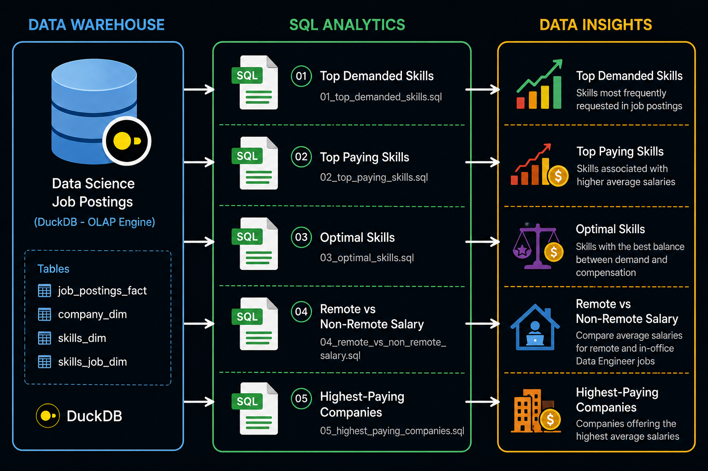

# 📊 Data Engineer Job Market Analysis — SQL

A SQL-based analysis of the Data Engineer job market using real-world job posting data. This project explores **job demand, salaries, remote work, companies, and technical skills** to identify trends in the Data Engineering job market.

The project was built using **SQL and DuckDB**, with a focus on writing analytical queries and turning job-posting data into meaningful insights.

---



## 🎯 Project Objectives

This project aims to answer practical questions such as:

* Which skills are most demanded for Data Engineers?
* Which skills are associated with higher salaries?
* Do remote Data Engineer jobs offer higher average salaries?
* Which companies offer the highest average salaries?
* Which skills provide the best balance between demand and compensation?

The goal is to use SQL not only to retrieve data, but to **answer real-world questions and generate data-driven insights**.

---

## 🗂️ Data Model

The project uses a **star-schema-style data warehouse** consisting of fact, dimension, and bridge tables.

### Main Tables

| Table               | Purpose                                                                             |
| ------------------- | ----------------------------------------------------------------------------------- |
| `job_postings_fact` | Job postings, salaries, titles, locations, remote status, and other job information |
| `company_dim`       | Company names and company-related information                                       |
| `skills_dim`        | Skill names and skill-related information                                           |
| `skills_job_dim`    | Connects job postings with their required skills                                    |

The `skills_job_dim` table handles the **many-to-many relationship** between job postings and skills.

### Data WareHouse


---

## 🛠️ Tech Stack

* **SQL** — Data analysis and transformation
* **DuckDB** — SQL query engine
* **VS Code** — SQL development environment
* **Git & GitHub** — Version control

---

## 🔍 Analysis Performed

### 1. 📈 Top Demanded Skills

**Question:** Which skills are most frequently requested for Data Engineer positions?

This analysis counts job postings associated with each skill and ranks them based on demand.

**SQL concepts used:**

* `INNER JOIN`
* `COUNT()`
* `GROUP BY`
* `ORDER BY`
* `LIMIT`
* `WHERE`

---

### 2. 💰 Top-Paying Skills

**Question:** Which skills are associated with the highest salaries?

Salary information is aggregated by skill to identify technologies associated with higher-paying Data Engineer positions.

Only jobs with available salary information are considered.

**SQL concepts used:**

* `AVG()`
* `MEDIAN()`
* `COUNT()`
* `GROUP BY`
* `HAVING`
* `ORDER BY`
* `IS NOT NULL`

---
### 3. ⚖️ Optimal Skills

**Question:** What are the most optimal skills for Data Engineers when balancing demand and salary?

This analysis combines skill demand and salary to identify skills that provide a strong overall balance between market demand and compensation.

The analysis uses:

* Median salary
* Demand count
* Natural logarithm of demand
* A combined optimal score

The logarithmic transformation reduces the effect of extremely common skills while still considering market demand.

### 4. 🌐 Remote vs Non-Remote Salary Analysis

**Question:** Does remote work affect the average salary of Data Engineers?

This analysis compares remote and non-remote Data Engineer positions using:

* Number of job postings
* Average yearly salary

Only positions with available annual salary information are included.

**SQL concepts used:**

* `CASE`
* `COUNT()`
* `AVG()`
* `WHERE`
* `GROUP BY`

---

### 5. 🏢 Highest-Paying Companies

**Question:** Which companies offer the highest average salaries for Data Engineers?

Companies are ranked based on their average yearly salary.

To make the comparison more reliable, only companies with at least **5 Data Engineer job postings** are included.

**SQL concepts used:**

* `INNER JOIN`
* `AVG()`
* `COUNT()`
* `GROUP BY`
* `HAVING`
* `ORDER BY`
* `LIMIT`

---


**SQL concepts used:**

* CTEs
* `MEDIAN()`
* `COUNT()`
* `LN()`
* `CASE`
* Aggregations
* Calculated metrics
* Ranking

---

## 🧠 SQL Skills Demonstrated

### Querying & Filtering

* `SELECT`
* `WHERE`
* `IS NOT NULL`
* Boolean conditions
* `CASE`

### Aggregation

* `COUNT()`
* `AVG()`
* `MEDIAN()`
* `ROUND()`
* `GROUP BY`
* `HAVING`

### Combining Data

* `INNER JOIN`
* Fact-to-dimension joins
* Many-to-many relationships through bridge tables

### Analytical Thinking

This project also demonstrates the ability to:

* Translate business questions into SQL
* Choose appropriate metrics
* Handle missing data
* Compare different groups
* Analyze demand and compensation
* Interpret SQL results

---

## 📁 Project Structure

```text
SQL-Data-Engineer-Job-Market/
│
├── 1_EDA
├── images
├── queries/
│   ├── 01_top_demanded_skills.sql
│   ├── 02_top_paying_skills.sql
│   ├── 03_optimal_skills.sql
│   ├── 04_remote_vs_non_remote_salary.sql
│   └── 05_top_paying_companies.sql
    └── README.md
    
```

---

## 🎓 What I Learned

Through this project, I strengthened my ability to:

1. Work with a relational data model.
2. Understand fact, dimension, and bridge tables.
3. Write multi-table SQL queries.
4. Perform analytical aggregations.
5. Handle NULL and incomplete data.
6. Use CTEs and advanced SQL techniques.
7. Translate real-world questions into SQL.
8. Interpret and communicate data-driven results.

---

## 🚀 Future Improvements

Future versions of this project could include:

* Building a **Python + SQL ETL pipeline**
* Adding automated data-quality checks
* Moving the data warehouse to the cloud
* Scheduling pipelines using **Apache Airflow**
* Creating a dashboard for job-market trends
* Adding time-based analysis of skill demand and salaries

---

## 📌 Conclusion

This project demonstrates my ability to use **SQL to analyze real-world job-market data and generate data-driven insights**.

It provides a strong foundation in analytical SQL and database concepts that I can build upon with future Data Engineering projects involving **Python, ETL pipelines, orchestration, and cloud technologies**.
